# Getting Started with met-viewer

A hands-on tour of met-viewer: a C++20 desktop app for viewing and analyzing
gridded meteorological data (GRIB1/2, NetCDF4/CF, and NOAA ARL). By the end you
will have opened a file, colormapped a field, draped it over a basemap, pulled a
vertical cross-section and a skew-T sounding, and animated a field through time.

This guide is task-oriented. For system prerequisites and the build, see the
[README](../README.md); for architecture and design rationale, see
[Design.md](../Design.md).

---

## 1. Build and launch

If you have not built yet, follow the [README](../README.md) (system packages +
vcpkg). In short:

```sh
git submodule update --init --recursive   # first time only
cmake --preset release
cmake --build --preset release
```

> The **first** configure builds Qt6, OpenSSL, ecCodes, netcdf-c, PROJ, and more
> from source via vcpkg — expect it to take a long time. Subsequent builds are fast.

Launch the viewer:

```sh
./build/release/viewer/app/met_viewer
```

**On a Wayland session, force the X11 backend** — the vcpkg Qt build ships the
`xcb` platform plugin, not `wayland`:

```sh
QT_QPA_PLATFORM=xcb ./build/release/viewer/app/met_viewer
```

You can also open a file straight from the command line:

```sh
QT_QPA_PLATFORM=xcb ./build/release/viewer/app/met_viewer tests/fixtures/era5_t_pl.nc
```

**No data of your own yet?** The repository ships small sample files under
[`tests/fixtures/`](../tests/fixtures/) that this tutorial uses throughout:

| Fixture | What it is | Good for |
| --- | --- | --- |
| `era5_t_pl.nc` | ERA5-shaped NetCDF: temperature `t`, humidity `r`, geopotential `z` on 9 pressure levels, 2 times | levels, contours, cross-sections, soundings, height labels |
| `wind_uv_850.grib2` | GRIB2 U/V wind at 850 hPa | wind barbs / streamlines, derived wind quantities |
| `lambert_sfc.grib2` | GRIB2 surface field on a **Lambert** projected grid | projected-grid warp over a basemap |
| `small_latlon.arl` | NOAA **ARL** packed file (surface + 1000 hPa), over N. America | the ARL reader |
| `regular_ll_t500.grib1` / `.grib2` | single field `t` @ 500 hPa | quick GRIB1 vs GRIB2 check |

---

## 2. The window at a glance

```
┌───────────────────────────────────────────────────────────────────────┐
│ File   View                                    (menu bar)               │
│ [Pan] [Cross-section] [Sounding] [Time series]  (Tools toolbar / modes) │
├──────────────┬────────────────────────────────────────┬────────────────┤
│ Data         │  ┌── canvas ─────────────────────────┐ │  ▾ Map         │
│              │  │                                    │ │   Colormap …   │
│ Variable /   │  │        (the active view)           │ │   Auto range   │
│  Level tree  │  │                                    │ │   Basemap …    │
│              │  │                                    │ │   Field opacity│
│ Level:  […]  │  │                                    │ │   Coastlines   │
│ Derived:[…]  │  │                                    │ │   Wind …       │
│              │  │                                    │ │  ┌──────────┐  │
│ Showing: …   │  └────────────────────────────────────┘ │  │ colorbar │  │
│              │   [ 2D Plot | Map | Skew-T … ]  (tabs)   │  └──────────┘  │
├──────────────┴────────────────────────────────────────┴────────────────┤
│ Time   ⏮ ⏯ ⏭  ├────────●───────────────┤   2007-01-14T12:00Z (1/2)      │
├─────────────────────────────────────────────────────────────────────────┤
│ t @ 500 hPa: 254.3 K  (63.0°, 12.0°)          (status bar / probe)       │
└───────────────────────────────────────────────────────────────────────┘
```

…and the same layout in the running app:


*The **Data** dock (left), the active view (center) with its control panel and
colorbar (right), and the **Time** dock (bottom). The screenshots in this guide
use an ERA5 pressure-level GRIB over the US Southwest; the numbered steps use the
in-repo [`tests/fixtures/`](../tests/fixtures/) files so you can reproduce them.*

- **Data dock (left)** — the variable/level tree, the **Level** selector, the
  **Derived** quantity selector, and a live **Showing:** label describing exactly
  what is on screen.
- **Views (center)** — **2D Plot** and **Map** start as tabs; analysis views
  (cross-section, skew-T, time series) open as additional tabs. **Each view owns
  its own control panel** on the right — collapse it with the **▾/▸** header.
- **Time dock (bottom)** — play/pause, step, a scrubbable time slider, and the
  current valid time.
- **Tools toolbar (top)** — the picking **modes** (Pan / Cross-section /
  Sounding / Time series), described in [§7](#7-analysis-tools).
- **Status bar (bottom)** — the **probe** readout (value under the cursor) and
  mode hints.

Every panel and the toolbar can be closed with its **×** and brought back from the
**View** menu. Panels can be dragged, split, tabbed, and floated — see [§8](#8-arranging-your-workspace).

---

## 3. Your first field (2D Plot)

1. **File ▸ Open…** (`Ctrl+O`) and choose `tests/fixtures/era5_t_pl.nc`.
   The status bar reports `Opened … (NetCDF/CF)` and the first field is displayed
   automatically on the **2D Plot** tab.
2. In the **Data** dock, expand **t — Temperature** and click a level, e.g.
   **500 hPa**. The plot redraws; the **Showing:** label updates to
   `Showing: Temperature @ 500 hPa · <valid time>`.
3. **Read values off the plot:** move the mouse over the field — the status bar
   shows the temperature and the lat/lon under the cursor.

### Color and range (right-hand panel)

The 2D Plot's control panel gives you:

- **Colormap** — `viridis`, `turbo`, `magma`, `cividis`, plus two diverging maps
  `RdBu (diverging)` and `coolwarm`. Diverging maps auto-center on zero.
- **Auto range** (on by default) — the color scale fits the field's min/max.
  Uncheck it to type explicit **Min**/**Max** values and pin the scale (handy when
  comparing levels or times on a fixed scale).
- **Colorbar** — a legend beneath the controls, labeled in the field's units.

The same temperature field under the **turbo** colormap:

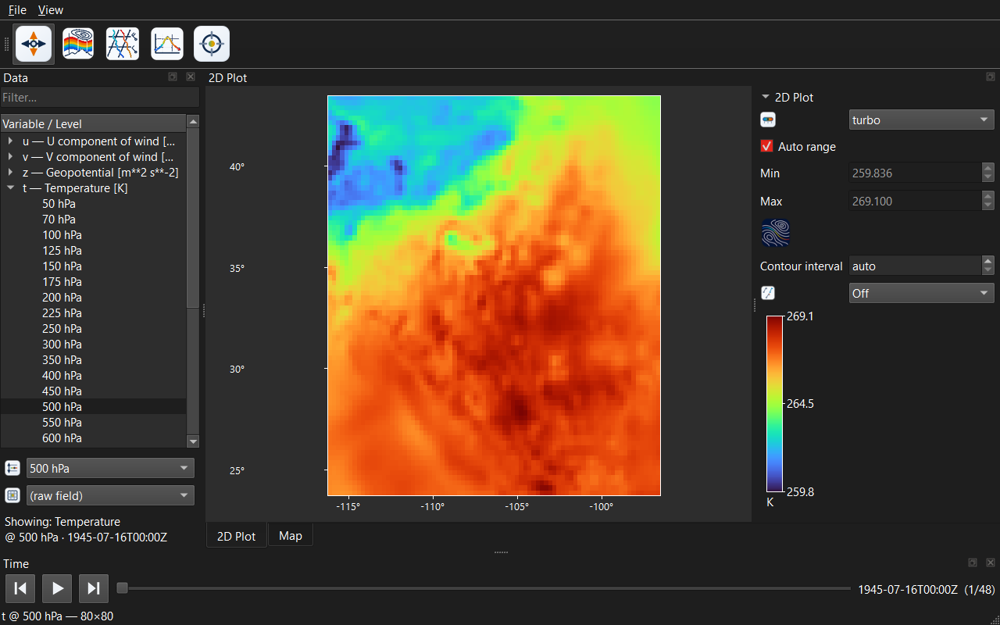

Diverging colormaps auto-center on zero, so they suit signed fields — here the
**RdBu (diverging)** map on the U-wind component (red eastward, blue westward):

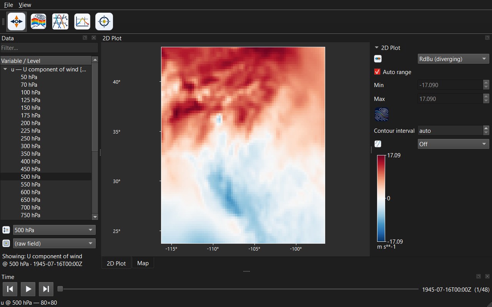

### Contours

Check **Contours** to overlay isolines on the plot. Leave **Contour interval** at
`auto` for a "nice" automatic spacing, or type an interval in the field's units
(e.g. `2` for every 2 K).


---

## 4. The GIS map

Click the **Map** tab. The field is warped into Web Mercator and draped
semi-transparently over basemap tiles.

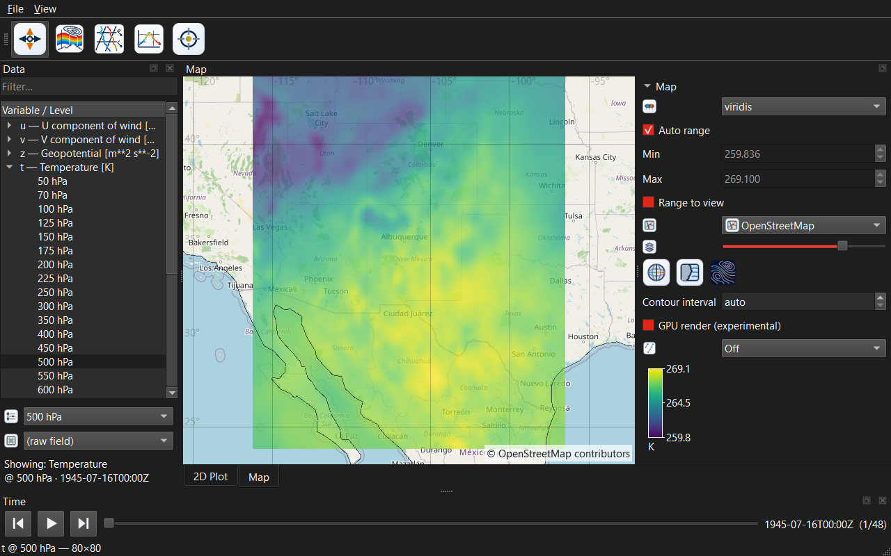

- **Pan** — left-drag. **Zoom** — mouse wheel (zooms toward the cursor).
- **Fit to data** — **right-click ▸ Fit to data** re-frames the view on the
  current field's extent. (The map also re-fits automatically when you open a file
  covering a different region.)
- **Probe** — hover to read the value under the cursor in the status bar.

The Map's control panel adds:

- **Basemap** — `OpenStreetMap`, `Carto Light`, `Carto Dark`,
  `Esri World Imagery` (satellite), `OpenTopoMap` (terrain). Attribution is shown
  in the corner as each source requires.
- **Field opacity** — blend the data against the basemap.

The same field over the **Carto Dark** and **Esri World Imagery** basemaps:

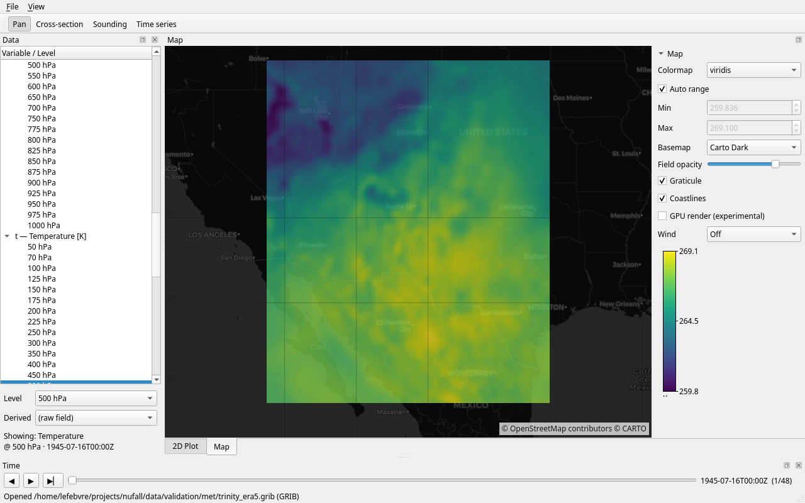

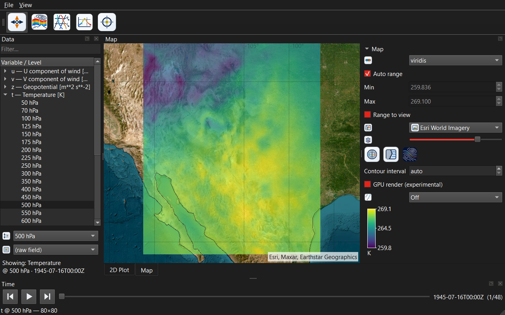

- **Graticule** / **Coastlines** — lat/lon grid and Natural Earth coastlines.
- **GPU render (experimental)** — an OpenGL warp path. It is **off by default**;
  the CPU warp is the robust default (the GPU path shows a driver artifact on some
  Mesa/radeonsi GPUs — see [Design.md](../Design.md)).

> **Tiles need network access.** Basemap tiles are fetched from the web and cached
> on disk. Offline, the data still warps and renders correctly over a blank
> background.

**Try a projected grid:** open `tests/fixtures/lambert_sfc.grib2` — the Lambert
grid is warped correctly onto the same Mercator basemap.

### Wind overlays

Open a file with a U/V wind pair, e.g. `tests/fixtures/wind_uv_850.grib2`. In the
Map panel set **Wind** to:

- **Barbs** — standard wind barbs on a screen lattice, or
- **Streamlines** — traced flow lines.


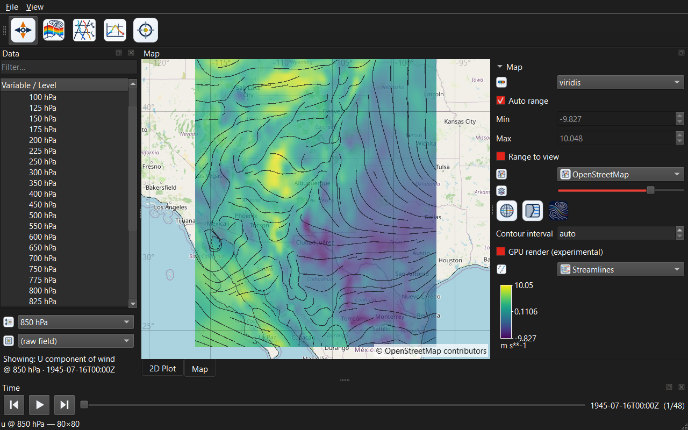

The 2D Plot panel offers **Off / Barbs**. Grid-relative winds on projected grids
are rotated to earth-relative automatically.

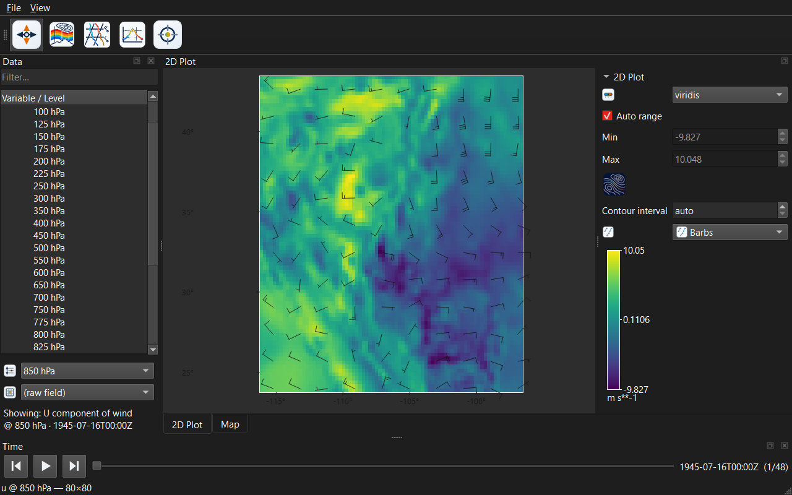

---

## 5. Derived quantities

The **Derived** selector in the Data dock computes a quantity from the loaded
variables instead of showing the raw field:

- **Wind speed** and **Wind direction** — need a U/V pair.
- **Relative vorticity** and **Divergence** — computed from U/V.
- **Potential temperature θ** — from temperature on a pressure level.

Pick one and the field views recompute; the **Showing:** label notes the derived
quantity and its source variable, e.g. `Showing: Wind speed (from u) @ 850 hPa`.
If a derived quantity is not available for the current selection, the app falls
back to the raw field and tells you so in the status bar.

**Try it:** open `wind_uv_850.grib2`, set **Derived ▸ Wind speed**.

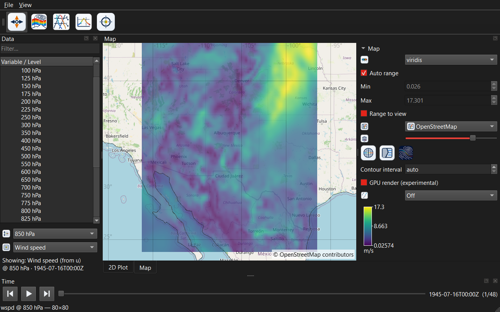

---

## 6. Time and animation

When a file has multiple time steps, the **Time** dock drives them:

- **Scrub** the slider, or use the **⏮ / ⏭** step buttons, to jump to any time.
  The valid time and index (e.g. `1/2`) are shown on the right.
- **Play ▶** animates through the time axis at the configured frame rate.
  Decoded frames are held in an LRU **field cache** and upcoming steps are
  prefetched, so playback is smooth once frames are warm.

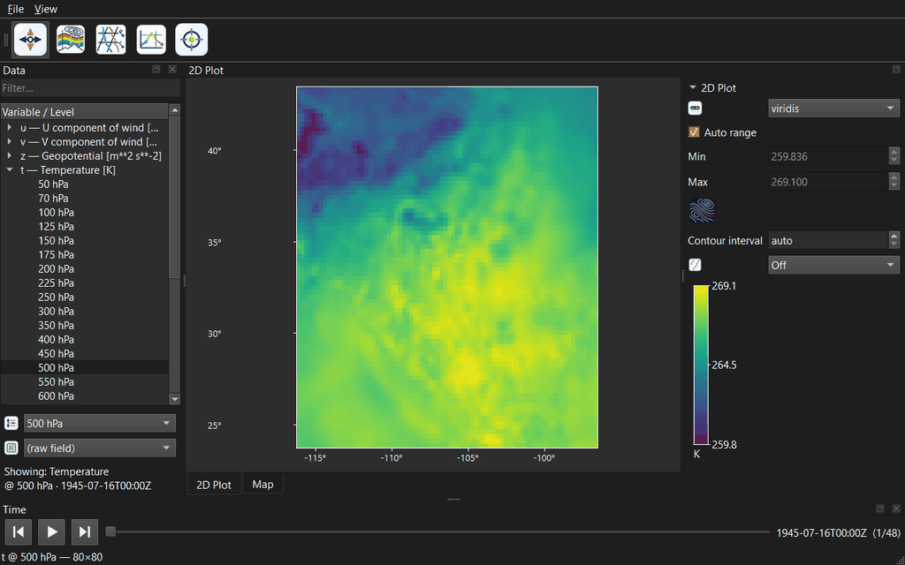

Open cross-sections, soundings, and time-series markers **follow the time slider**
— scrubbing time re-extracts them at the new step (see [§7](#7-analysis-tools)).

Tune animation and memory under **File ▸ Preferences…**:

- **Field cache budget** (MB) — how much decoded field data to keep in RAM.
- **Animation speed** (fps) — playback frame rate.

These settings, along with your window layout, colormaps, basemap, and overlays,
are **persisted** between sessions.

---

## 7. Analysis tools

Cross-sections, soundings, and time series are **picked on the Map**. Use the
**Tools** toolbar to choose a picking mode (choosing any non-Pan mode raises the
Map for you); the status bar tells you what each mode expects. Switch back to
**Pan** when you are done to restore drag-to-pan and the hover probe.

### Vertical cross-section

Needs a **multi-level** variable (e.g. `t` in `era5_t_pl.nc`).

1. Select the variable in the Data dock.
2. Toolbar ▸ **Cross-section**.
3. **Click** points along the path on the Map, then **double-click** to draw it.

A new **Section** tab opens: your path along the x-axis, a log-pressure y-axis, and
the field colormapped through the section's own color controls (with its own
colorbar). It re-extracts as you scrub time.

When the file carries geopotential height (`gh`, or ERA5's geopotential `z`), the
section is overlaid with **labelled isopleths of height** — the contour toggle in
its control panel turns them off. Height cannot be a second y-axis here: a pressure
surface tilts along the path, so its altitude is a field over the section, not a
ladder beside it. The cursor readout adds the height at the cursor. The toggle is
greyed out, not hidden, for a dataset with no height field.

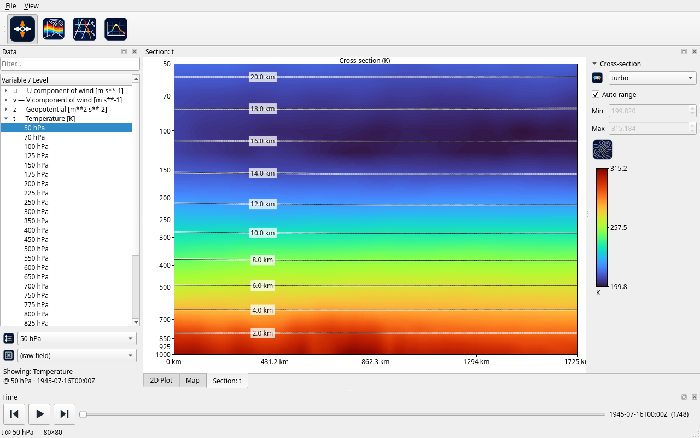

### Skew-T sounding

Needs **multi-level temperature** (`t`); humidity (`r`) adds a dewpoint trace, and
a U/V pair adds a wind profile.

1. Toolbar ▸ **Sounding**.
2. **Click** a point on the Map.

A **Skew-T** tab opens with a proper skew-T log-p diagram: skewed isotherms, dry
adiabats, and mixing-ratio lines in the background; the **temperature** (red) and
**dewpoint** (green) traces; a **legend**; and — when the file has wind — a column
of **wind barbs** down the right margin. It follows the time slider.

If the file carries geopotential height (`gh`, or ERA5's geopotential `z`), each
labelled isobar also gets the **altitude** the sounding puts it at, down the left
edge of the diagram, and the cursor readout adds a `Z` line in metres. Heights are
read from the file, never inferred from the temperature trace, so a file without
them simply shows none.

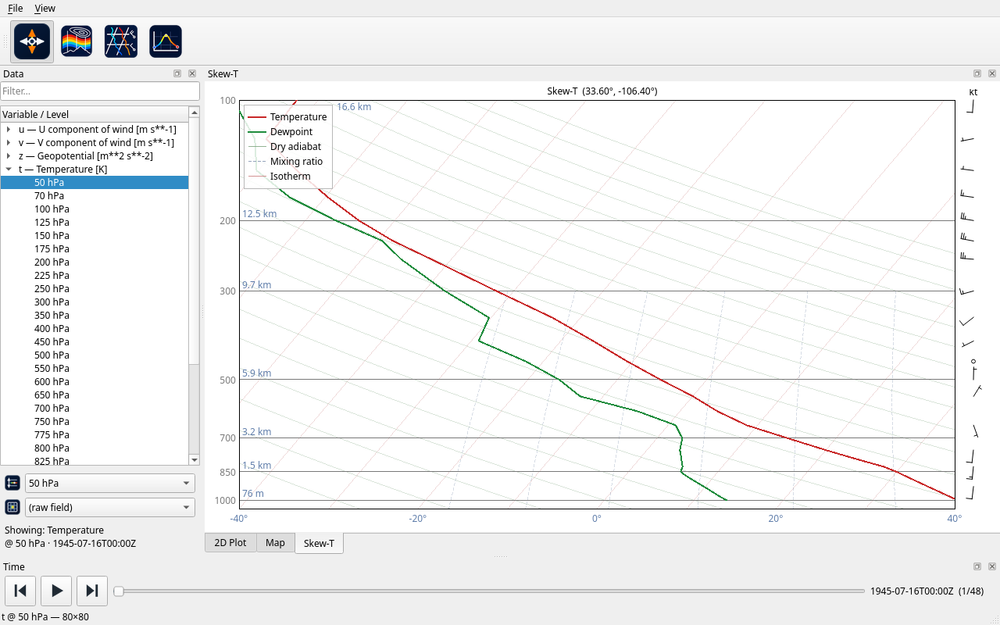

### Time series

Needs **multiple time steps**.

1. Select the variable/level to sample.
2. Toolbar ▸ **Time series**.
3. **Click** a point on the Map.

A **Series** tab plots the value at that point across all times, with a marker that
tracks the current time as you scrub.

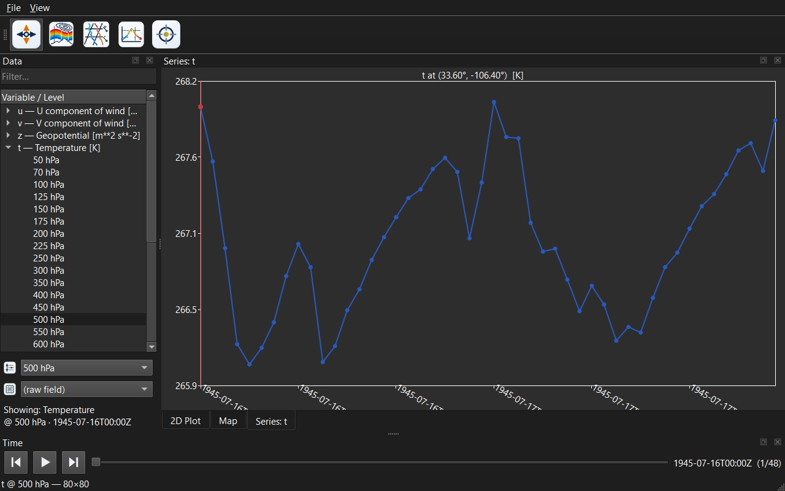

---

## 8. Arranging your workspace

The views live in a nested docking area, so you can build the layout you want:

- **Split / tile** — drag a view's tab (or title bar) to the **edge** of the area
  to dock it left/right/top/bottom, giving you two views **side by side** (e.g.
  Map next to a Skew-T).
- **Tab** — drag one view onto the **center** of another to stack them as tabs.
- **Float** — drag a view out of the window to pop it into its own floating window.
- **Close / restore** — analysis tabs close with their **×**. The **Data** and
  **Time** docks and the **Tools** toolbar can be hidden and brought back from the
  **View** menu.
- **Collapse controls** — each view's control panel collapses via its **▾/▸**
  header to maximize canvas space.

For example, a **cross-section** and a **skew-T** split side by side, each keeping
its own control panel:

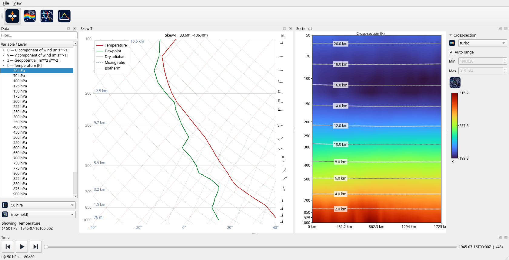

### Recently opened files

**File ▸ Open Recent** lists the last files you opened (most-recent first). Pick
one to reopen it, or choose **Clear Recent** to empty the list. The list persists
across sessions.

---

## 9. Command-line reference

```sh
QT_QPA_PLATFORM=xcb ./build/release/viewer/app/met_viewer [FILE] [options]
```

Run with `--help` for the full, auto-generated list.

| Option | Effect |
| --- | --- |
| `FILE` | Open a data file on launch (repeatable; the last one is shown) |
| `--var NAME` | Select the displayed variable by short name (e.g. `t`, `u`) |
| `--level HPA` | Select the pressure level in hPa (e.g. `500`) |
| `--colormap NAME` | Set the colormap (e.g. `turbo`, `"RdBu (diverging)"`) |
| `--basemap NAME` | Set the map basemap (e.g. `"Carto Dark"`) |
| `--map` | Start on the GIS **Map** tab |
| `--contours` | Turn on the 2D-plot contour overlay |
| `--wind N` | Wind overlay mode: `1` barbs, `2` streamlines |
| `--derived N` | Select a derived quantity by index |
| `--demo section` \| `sounding` \| `series` | Open the named analysis view on the demo point |
| `--demo-at LAT,LON` | Sample point the `--demo` triggers use |
| `--tile` | Tile a cross-section beside a skew-T (demonstrates split layouts) |
| `--size WxH` | Set the window size in pixels (e.g. `1680x860`) |
| `--time N` | Jump to a time-step index (e.g. to render GIF frames) |
| `--play` | Start time-animation playback |
| `--gpu` / `--cpu` | Force the GPU or CPU map-warp path |
| `--grab OUT.png` | Render the window to a PNG and quit (headless screenshot) |

**Headless screenshot** — useful for scripting or verifying a render without a
display (runs under `xcb`). These field-selection flags are exactly what
[`tools/gen_screenshots.sh`](../tools/gen_screenshots.sh) uses to render the images
in this guide:

```sh
QT_QPA_PLATFORM=xcb ./build/release/viewer/app/met_viewer \
  data.grib --var t --level 500 --map --grab /tmp/frame.png
```

---

## 10. Supported formats

Files are detected by **content**, not extension:

- **GRIB1 / GRIB2** (via ecCodes) — regular lat/lon, Gaussian, and projected
  (Lambert, polar-stereo) grids.
- **NetCDF4 / HDF5 with CF conventions** (via netcdf-c) — including packed ERA5
  downloads (scale/offset shorts, N→S latitudes, 0–360 longitudes, `_FillValue`).
- **NOAA ARL** packed — surface and upper-air, projected grids.

Opening a file reads **metadata only**; each 2D field is decoded lazily when you
select it, which is what makes large multi-message GRIB files and animation
tractable. Missing values are normalized to NaN everywhere and rendered
transparent.

---

## 11. Troubleshooting

- **"Could not find the Qt platform plugin" / blank window on Wayland** — run with
  `QT_QPA_PLATFORM=xcb …`. The vcpkg Qt build ships `xcb`, not `wayland`.
- **No basemap tiles** — tiles require network access; check connectivity. Data
  still renders over a blank background offline. Tiles are disk-cached after first
  fetch.
- **Text renders as boxes (□)** — the Qt build needs the `freetype`/`fontconfig`/
  `harfbuzz` features; these are in `vcpkg.json`. A clean rebuild fixes it.
- **Map field looks corrupted with GPU render on** — leave **GPU render
  (experimental)** off (the default). The CPU warp is correct; the GPU artifact is
  a known driver issue on some GPUs.
- **First build takes forever** — that is vcpkg compiling Qt et al. from source on
  the first configure. It is a one-time cost.
- **A cross-section/sounding/time-series won't open** — check the requirement: a
  multi-level variable (section), multi-level temperature `t` (sounding), or
  multiple time steps (series). The status bar explains what's missing.

---

## 12. Where to go next

- [Design.md](../Design.md) — architecture, data model, rendering, and the
  milestone roadmap.
- [`tests/fixtures/`](../tests/fixtures/) — the sample files used above.
- Run the test suite: `ctest --preset release`.

Point met-viewer at a real GFS/ERA5 GRIB, an ERA5 NetCDF download, or a HYSPLIT
ARL file and the same workflow applies.
